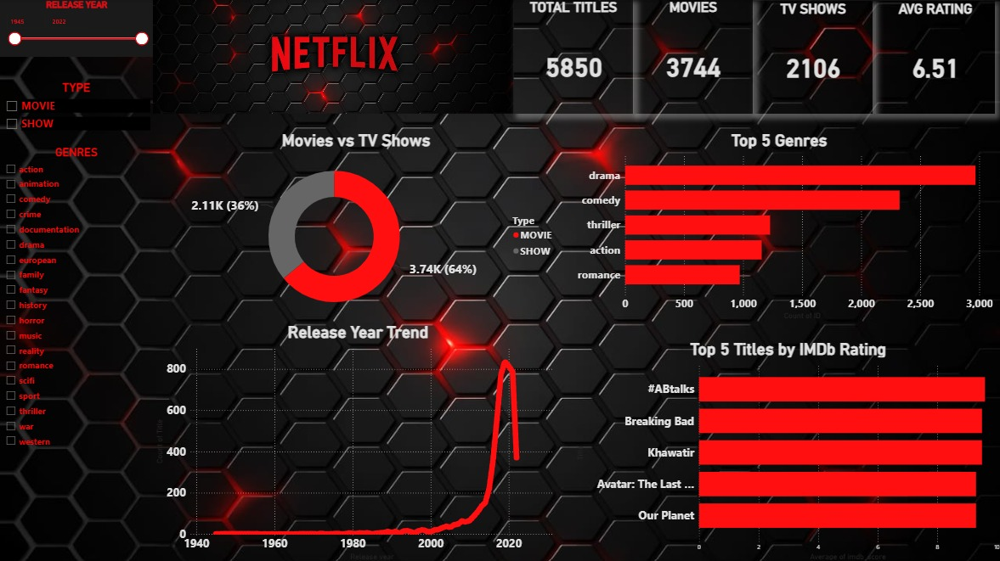

# 🎬 Netflix Content Analytics Dashboard

An interactive Power BI dashboard project focused on analyzing Netflix content trends, genre distribution, IMDb ratings, and platform growth over time.

## 📊 Dashboard Preview

## 🧠 Business Case

Netflix operates in a highly competitive streaming industry where content strategy directly impacts subscriber growth, engagement, and retention.

This project analyzes Netflix’s content library to uncover:
- What types of content dominate the platform
- How content has evolved over time
- Which genres drive engagement
- How ratings are distributed across titles

## 🛠 Tools & Skills Used

- Power BI  
- Power Query (Data Cleaning & Transformation)  
- DAX (Data Modeling & Measures)  
- Data Visualization  
- Business Intelligence  
- Exploratory Data Analysis (EDA)  

## 📊 Key Metrics Analyzed

- Total Titles (Movies vs TV Shows)  
- Genre Distribution  
- Content Growth Over Time  
- IMDb Rating Distribution  
- Release Year Trends  
- Content Type Breakdown  

## 📈 Key Business Insights

### 1. Movies Dominate Netflix’s Content Library  
Movies account for over 70% of total Netflix content, significantly more than TV Shows.

**Business Impact:**  
Supports a strategy focused on rapid catalog expansion through movies.

### 2. Drama and Comedy Lead Content Distribution  
Drama is the most dominant genre, followed by Comedy and Action.

**Business Impact:**  
Confirms strong audience preference for mass-appeal entertainment genres.

### 3. Content Growth Accelerated After 2010  
Netflix content increased rapidly after 2010, with peak growth between 2015–2020.

**Business Impact:**  
Reflects successful global expansion and investment in original content.

### 4. High-Rated Titles Are Limited  
Only a small portion of titles achieved high IMDb ratings.

**Business Impact:**  
Highlights need to focus on producing fewer but higher-quality flagship titles.

### 5. TV Shows Drive Strong Engagement  
Although fewer in number, TV Shows contribute significantly to viewer retention.

**Business Impact:**  
Supports increased investment in multi-season content for retention.

### 6. 2015–2020 Was the Peak Growth Period  
Most content expansion happened during this period.

**Business Impact:**  
Serves as a benchmark for forecasting future content strategies.

### 7. Entertainment Genres Dominate Strategy  
Drama, Comedy, and Action dominate Netflix’s library.

**Business Impact:**  
Reinforces focus on high-demand, global-appeal genres.

## 📌 Dashboard Features

- Movies vs TV Shows comparison  
- Genre analysis  
- Content growth trends  
- IMDb rating distribution  
- Release year analysis  
- Interactive filters & slicers  

## 🎯 Conclusion

This dashboard transforms Netflix’s content data into actionable insights that support strategic decision-making in content production, acquisition, and recommendation systems.

It demonstrates strong skills in **Power BI, data analysis, and business intelligence storytelling**.

## 🚀 Project Impact

This analysis helps identify:
- What content Netflix should invest in  
- How viewing preferences are distributed  
- How content strategy has evolved over time  

